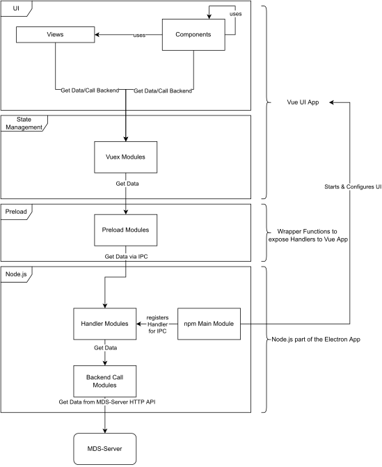

Development
###########

This chapter concerns documentation related to the development of the MDS-Desktop app not the use of it by endusers.

Development Environment
=======================

This chapter provides instructions on how to setup the recommended development environment for the MDS-Desktop project.
The MDS-Desktop app is built, on top of :vite-electron-builder-homepage:`vite-electron-builder <>` as an :electron-homepage:`Electron <>` application which uses :vue-homepage:`Vue.js <>` to render the ui and :vite-homepage:`Vite <>` to build the vue.js application.
As an Electron app this application is built on top of :node-homepage:`Node.js <>` and uses the :npm-homepage:`npm <>` package manager for dependency management and the build process.

Setup Development Environment
-----------------------------

First you need to setup Node.js and npm if you haven't already.
To install both download and execute the :node-installer:`Node.js Installer <>` or use a :node-pm-installer:`package manager <>` for the installation, if available.

Next if you just want to run the MDS-Desktop app you can clone the regular repository using:

.. code-block:: sh

    git clone https://github.com/mobile-directing-system/mds-desktop.git

If you want to contribute however, you need to create a fork of the regular repository and clone the fork instead.
Finish setting up the app by changing into the root directory of the repository and run ``npm i``.
To run the app in dev mode with HMR for most parts of the app run ``npm run watch``.
Lasty to run the app in productiion mode with the statically compiled vue ui run ``npm run prod``.

You can use any Editor you like to work with the app but we strongly recommend :vscode-homepage:`VSCode <>`.
This editor enable comfortable development by providing a number of extensions that help with the developement.
Recommended extensions for working on the app are *npm Intellisense*, *Vue Language Features*, *ESLint* and *Tailwind CSS IntelliSense*.

Technolgies & Architecture
==========================

This chapter covers used technologies, theirs docs, if necessary how they are used and the architecture of the MDS-Desktop app.

Technologies
------------

For this :electron-homepage:`Electron <>` app we use :vue-homepage:`Vue.js <>` as the web framework with :tailwind-homepage:`tailwindcss <>` and :flowbite-homepage:`Flowbite <>` as the UI framework and the logic is writtin in Typescript.
For routing we use :vue-router-homepage:`vue-router <>`.
For state management of the UI we use :vuex-homepage:`vuex <>` with the :vuex-smart-module-homepage:`vuex-smart-module <>` to have TypeScript support.
We use :lodash-homepage:`Lodash <>` as a utitlity library in the frontend.
The vue app the UI uses :vite-homepage:`Vite <>` for building and bundling.
The communication with the backend is implemented using :axios-homepage:`Axios <>`.

Architecture
------------

As an Electron app the MDS-Desktop app is split into three parts. 
The first is the Website which defines the UI, for which we use a web app developed in vue.
The second is the Preload Module which defines what Node.js functionality is usable from the web app.
Here we use is mainly to expose wrapper functions around the IPC calls to the Node.js part of the app.
Lastly there is the Node.js part. This part starts & configures the browser windows to display the web app and implements other functionality not available to JS in the browser such as access to the files on the computer.

The Vue UI app is split between the router, views, components and the vuex state.
The app is structured by using the router to route between different views.
These views themselves are made up of components, HTML and Typescript.
Those components them are made up similary to the view, but in contrast to the views they are supposed to be usable at multiple points in the application.
We decide on which functionality to put into a component based on if it is going to be reused or not.
The data which is displayed by the UI is taken from vuex which we use to manage the state of our app.

.. warning:: Both views and components are written in the *SFC* format using Vue3 with the Composition API. We also use Typescript and the `<script setup>` tag for our code. When ever possible try to use those technolgies and make sure that when browsing the :vue-doc:`Vue.js Documentation <>` you have the toggle at the top of the sidebar set to Composition API.

To get started with Vue.js take a look at the :vue-doc:`Vue.js Documentation <>`.
For an introduction to the vue-router visit the :vue-router-guide:`vue-router Guide <>`.
To get a general understanding of vuex you can orient yourself at the :vuex-guide:`vuex Guide <>`.
But we use the vuex-smart-module to gain TypeScript support for vuex and used the README in the :vuex-smart-module-github:`vuex-smart-module Github <>` orient ourself when writing our vuex module.

The Preload Module is mostly autmated and only conists of wrapper functions to expose the IPC calls to the vue app.
But here it is **Important** to note that the auto-export plugin currently is bugged and needs all of the functions you want to export to be on a seperate line and in a seperate export statement.
If this is not done the vue app will not be able to find the preload module.

We use the Node.js part mostly to implement the skaffolding of the app (e.g. start browser window with the web app and hide window bar, implement exit window function, etc.) and the IPC, Handler and client-side implementation of the MDS-Server HTTP API.
To Familiarize youself with Electron you can use the :electron-intro:`Electron Introduction <>`.

Directory Structure of the Project
----------------------------------

.. code-block:: sh

    docs/                       # All the documentation, both vuepress and sphinx
    Makefile                    # Makefile to build the sphinx documentation (run make in
                                # project root)
    node_modules                # Contains the downloaded node packages/modules (don't touch)
    package.json                # Conatins node.js configuration, e.g. entry point into the app,
                                # dependecies, scripts (what can be run with npm run [command])
    packages/                   # Contains the source code of the app and configuration specific
                                # to the different parts of the app
    postcss.config.js           # Part of the TailwindCSS configuration. Concerns only the
                                # renderer part of the app. Is here for build compatibility
                                # purposes with the production build. Must be the same as the
                                # packages/renderer/postcss.config.js file
    README.md                   # Main README of the project. Mostly points to the sphinx
                                # documentation
    scripts/                    # contains mostly watch.js to support HMR with vite and electron
    tailwind.config.js          # Main TailwindCSS configuration. Concerns only the renderer
                                # part of the app. Is here for build compatibility purposes
                                # with the production build. Must be the same as the
                                # packages/renderer/tailwind.config.js file
    tests/                      # Contains E2E tests
    vitest.config.js            # Configuration for the vitest testing framework
    docs/make.bat               # Build the sphinx documentation on windows (run make.bat)
    docs/images                 # Contains the images used in the sphinx documentation
    docs/index.rst              # Entry point into the sphinx documentation (toctree)
    docs/conf.py                # Configuration for the sphinx documentation contains
                                # the definition of external links among other things
    docs/sites                  # Contains the chapters of the sphinx documentation
    docs/_build                 # Contains the built sphinx documentation in HTML files
    docs/README.md              # Entry point into the vupress documentation
    docs/.vuepress              # Contains configuration and build products of the vuepress
                                # documentation
    docs/.vuepress/config.ts    # Configuration of vuepress (mainly instruct vuepress to use
                                # vite as the bundler)
    packages/main/              # All code and configs specific to the main node.js part of 
                                # the electron app
    packages/preload/           # All code and configs specific to the preload module (mostly
                                # wrappers and auto-generated)
    packages/renderer/          # All code and configs specific to the renderer part (UI) of
                                # the electron app
    packages/types/             # Contains the types for entities (e.g. Users, Groups, etc.)
                                # Used in all three parts of the app
    packages/*/vite.config.js   # Configuration for Vite for all three different parts
    packages/*/tsconfig.json    # Configuration for the Typescript compiler for all three
                                # different parts
    packages/*/src/             # Source code for the three different parts
    packages/*/dist/            # Build products for the three different parts
    packages/main/src/backend       # Code for the communication with the MDS-Server HTTP
                                    # API including e.g. the caching of the Auth Cookie
    packages/main/src/config        # Rudimentary config file
    packages/main/src/index.ts      # Main entry point into the whole app. Starts the Windows,
                                    # registers the ipc handlers, etc.
    packages/main/src/ipcHandlers   # Implementation of ipcHandler wrappers for the backend
                                    # comms functions
    packages/main/src/windows       # Contains the code for the different windows
    packages/renderer/index.css             # Main CSS for the whole UI
    packages/renderer/index.html            # Main Page for the SPA UI vue app
    packages/renderer/postcss.config.js     # See postcss.config.js above
    packages/renderer/tailwind.config.js    # See tailwind.config.js above
    packages/renderer/src/App.vue           # Main Vue file.
    packages/renderer/components/           # Contains resuable vue components
    packages/renderer/constants/            # Contains constants such as permissions strings
    packages/renderer/src/index.ts          # Main logic entry point into the vue app.
                                            # Starts the whole vue app.
    packages/renderer/src/router/           # Contains the definition and configuration of
                                            # the vue-router
    packages/renderer/src/store/            # Contains all the code related to the
                                            # implementation and configuration of the 
                                            # vuex store & vuex modules
    packages/renderer/src/views/            # contains the pages routed through with the
                                            # router

Minimal Implementation for new Service
--------------------------------------

To implement a minimal service for a new entity (e.g. User, Group, etc.) do the following:

#. Start with implementing the calls to the backend API using Axios in *main/src/backend*. Once implemented export them in the *main/src/backend/index.ts* file.
#. Use them to write a handler-wrapper in *main/src/ipcHandlers*. Export these handlers in the *main/src/ipcHandlers/index.ts*.
#. Register these handlers in ipcMain in *main/src/index.ts* and give them speaking names.
#. Write a wrapper functions for calling those ipcHandlers in *preload/src* and export them in *preload/src/index.ts*.

   .. warning:: Make sure that the names used for calling the ipcHandlers are **exactly** the same as the ones given to them when registering them. **Important** There is a bug with the auto-export plugin that requires you to export each wrapper function sperately on a new line. If this is not done the vue code can't find the preload module.

#. Lastly implement a seperate vuex module to manage the state of the retrieved entities. Use the preload wrapper functions to fetch data from the backend.

   .. warning:: When writing a new vuex module and utilizing the IPC wrapper exposed by the preload module it is necessary to *undom* the objects of the vuex state before they are passed to the wrapper function. If not electron will throw an error complaining that it cannot serialize the object. With *undom* we mean that you must create a deep copy of the object, so that only basic data types such as number, booleans and strings are copied. Also only fields specified in the type of the object must be copied, but not additional fields created at runtime. This means that if an object holds a reference to another object or array those must be deep copied as well.

Component Documentation
=======================

Documentation for the components themselves (in *packages/renderer/src/components*) can be found either as code comments in the components themselves or in the form of a :vuepress-homepage:`VuePress <>` documentation.
The vuepress documentation is written in markdown files in *docs/README.md* and *docs/md/\**. To serve the documentation use the

.. code-block:: sh

    npm run docs:dev

command in the project root. If you want a statically built HTML version run 

.. code-block:: sh

    npm run docs:build

in the project root.

The vue components are documented with a general description of their use and particularities, as well as a list of their slots, events and props.

UI-Customization
================

Custom Colors
-------------