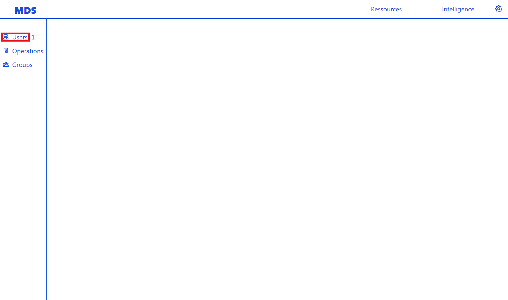
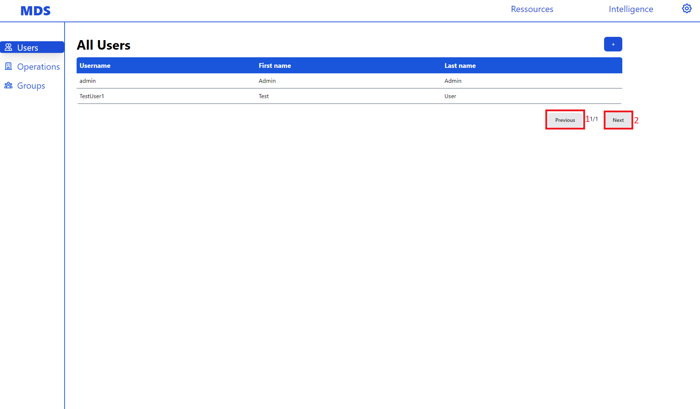
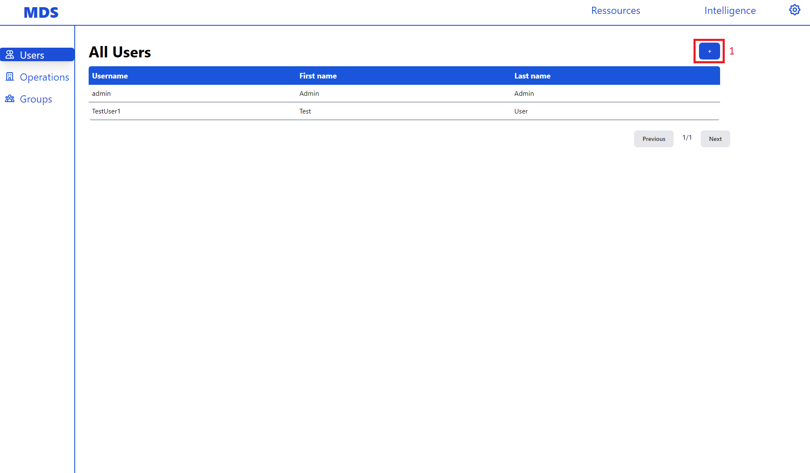
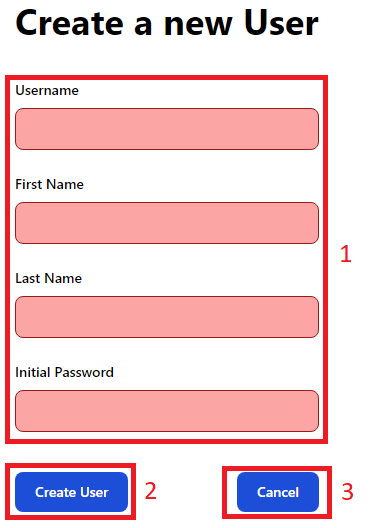
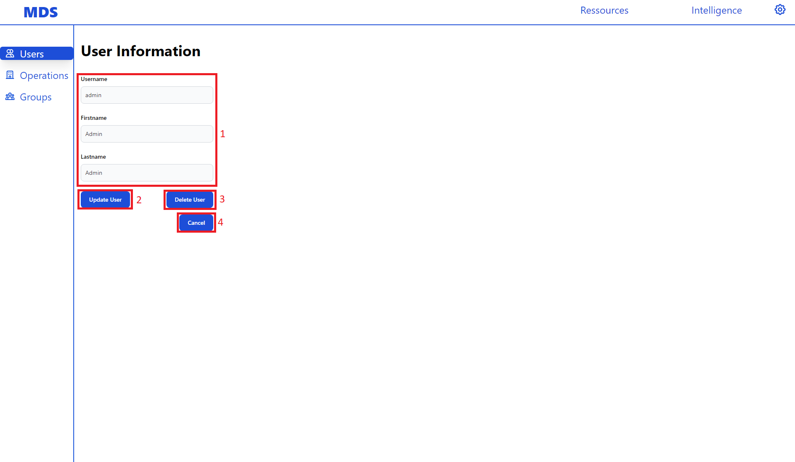
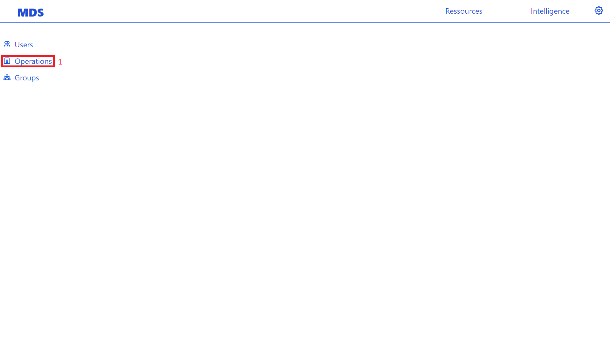

User Manual
###########

This chapter covers how to use the MDS-Desktop App as an Enduser.

Resource Management
===================

Here we show how to use the app to create different kinds of Resources in the Backend.
These include users, groups, operations.

Users
-----

In the app users can be created, changed and deleted.
To manage the users navigate to the users page by clicking of the Users link (**1**) in the sidebar.
Be aware only users with the *user.view* permission are able click this link.

This will open the users page with a paginated table with all the users.

Here you can click through pages of users using the next button (**1**) and previous button (**2**).
If the button become greyed out this means that there is not corresponding previous or next page.
The number of pages and the number of current page are displayed between the two pagination buttons.

Creating Users
^^^^^^^^^^^^^^

To create users first click the *+* button (**1**) on the users page on top of the paginated table.
Be aware only users with the *user.create* permission will be able to click this button.

This opens the user creation form.
Here you need to fill in the necessary fields in theuser creation form (**1**).
These are the username, first name, last name and password.
After filling in this form click on the Create User button (**2**) to create a user with the provided data.
If you want to cancel the user creation and return to the users page click the Cancel button (**3**).

Editing & Deleting Users
^^^^^^^^^^^^^^^^^^^^^^^^

To edit or delete users click on the user you want to change or delete in the paginated table.

This opens the user update form.
Here you can change the username, first name and last name of a user in the update user form (**1**).
To submit the user changes click the Change User button (**2**).
Be aware only users with the *user.update* permission can update users.
If you want to delete the user click on the Delete User button (**3**).
Be aware only users with the *user.delete* permission can delete users.
If you want to don't want to change the user and want to return to the users page click the Cancel button (**4**).

Operations
----------

In the app operations can be created and updated, but **not** deleted.
Instead of being deleted operations can be set to *archived*.
To manage operations click on the operations link in the sidebar (**1**).
Be aware only users with the *operation.view.any* permission can click this link.

This will open the operations page with a paginated table with all operations.