User Manual
###########

This chapter covers how to use the MDS-Desktop App as an Enduser.

Resource Management
===================

Here we show how to use the app to create different kinds of Resources in the Backend.
These include users, groups, operations.

Users
-----

In the app users can be created, changed and deleted.
To manage the users navigate to the users page by clicking of the Users link (**1**) in the sidebar.
Be aware only users with the *user.view* permission are able click this link.

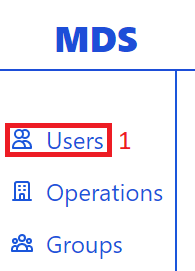

This will open the users page with a paginated table with all the users.

.. image:: ../images/all_users_pagination_buttons_screen_cropped.png
  :width: 600
  :alt: Use pagination on the users page

Here you can click through pages of users using the next button (**2**) and previous button (**1**).
If the button become greyed out this means that there is not corresponding previous or next page.
The number of pages and the number of current page are displayed between the two pagination buttons.

Creating Users
^^^^^^^^^^^^^^

To create users first click the *+* button (**1**) on the users page on top of the paginated table.
Be aware only users with the *user.create* permission will be able to click this button.

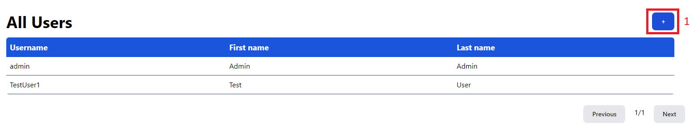

This opens the user creation form.
Here you need to fill in the necessary fields in the user creation form (**1**).
These are the username, first name, last name and password.
After filling in this form click on the Create User button (**2**) to create a user with the provided data.
If you want to cancel the user creation and return to the users page click the Cancel button (**3**).

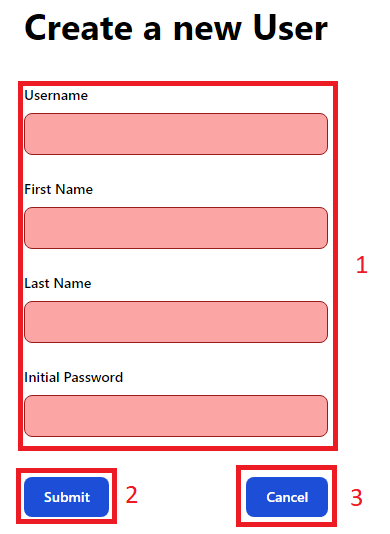

Editing & Deleting Users
^^^^^^^^^^^^^^^^^^^^^^^^

To edit or delete users click on the user you want to change or delete in the paginated table (**1**).

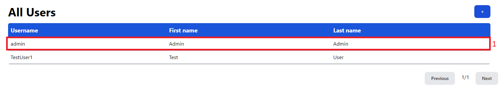

This opens the user update form.
Here you can change the username, first name and last name of a user in the update user form (**1**).
To submit the user changes click the Change User button (**2**).
Be aware only users with the *user.update* permission can update users.
If you want to delete the user click on the Delete User button (**3**).
Be aware only users with the *user.delete* permission can delete users.
If you want to don't want to change the user and want to return to the users page click the Cancel button (**4**).

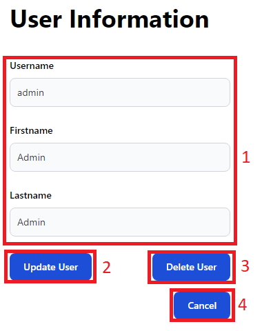

Operations
----------

In the app operations can be created and updated, but **not** deleted.
Instead of being deleted operations can be set to *archived*.
To manage operations click on the operations link in the sidebar (**1**).
Be aware only users with the *operation.view.any* permission can click this link.

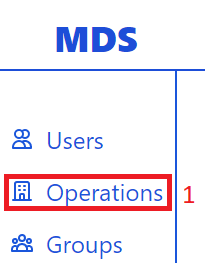

This will open the operations page with a paginated table with all operations.

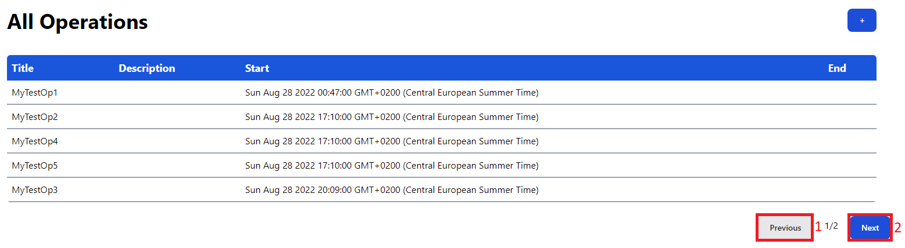

Here you can click through pages of operations using the next button (**2**) and previous button (**1**).
If the button become greyed out this means that there is not corresponding previous or next page.
The number of pages and the number of current page are displayed between the two pagination buttons.

Creating Operations
^^^^^^^^^^^^^^^^^^^

To create an operation click on the + button (**1**) on top of the paginated table.
Be aware only users with the *operation.create* permission can click on this button.

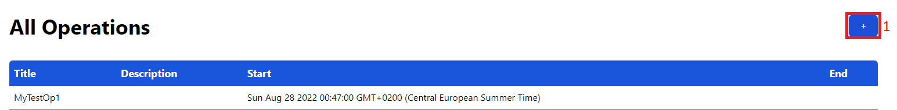

This opens the operation creation form.
Here you need to fill in at least the required fields for the operation creation form (**1**).
These are the title and a starting date & time. 
All other fields ore optional.
For more information on how to add and remove operation members see the section on :ref:`members`.
Beware only users with the *operation.members.update* permission can add and remove members and only users with the *operation.members.view* permission can see the operation members.
If you want to create a operation with the provided data click on the Create Operation button (**2**).
If you do not want to create a operation and instead return to the operations page click the Cancel button (**3**).

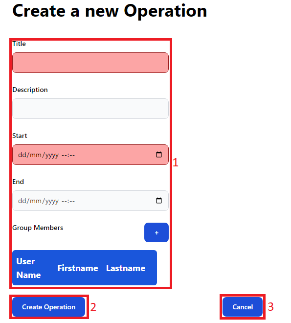

Editing Operations
^^^^^^^^^^^^^^^^^^

To change an operation click on the operation in the paginated table of operations you want to change (**1**).

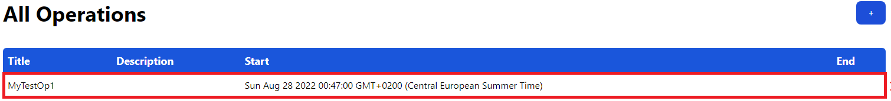

This opens the operation update form.
Here you  can change the title, description, start date & time as well as the end date & time, the operation members and the archived status of the operation in the operation update form (**1**).
The changing of the archived status is used to mark operations which are not needed anymore, as they cannnot be deleted for technical reasons.
For more information on how to add and remove members see the section on :ref:`members`.
Beware only users with the *operation.members.update* permission can add and remove members and only users with the *operation.members.view* permission can see the operation members.
If you want to change the operation with you provided data click on the Update Operation button (**2**).
Be aware that only users with the *operation.update* permission can click this button.
If you do not want to change the operation and return to the operations page click on the Cancel Button (**3**).

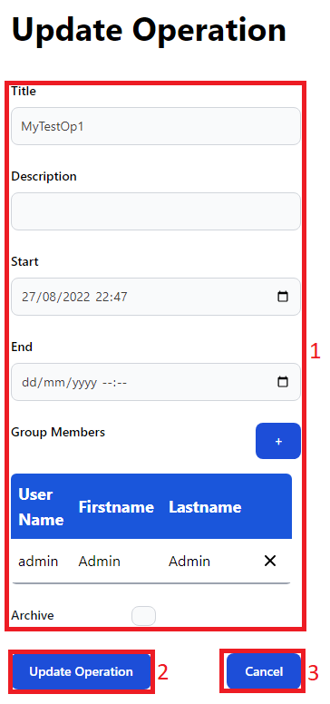

Groups
------

In the app groups can be created, updated and deleted.
To manage groups click on the groups link in the sidebar (**1**)
Be aware that only users with the *group.view* permission can click this link.

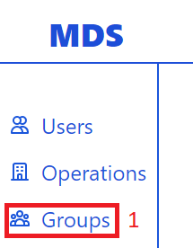

This opens the groups page with a paginated table of all groups.

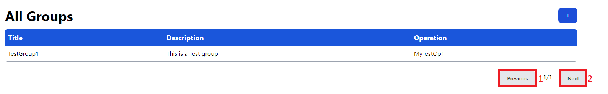

Here you can click through pages of groups using the next button (**2**) and previous button (**1**).
If the button become greyed out this means that there is not corresponding previous or next page.
The number of pages and the number of current page are displayed between the two pagination buttons.

Creating Groups
^^^^^^^^^^^^^^^

To create a group click on the + button (**1**) on top of the paginated table.
Be aware only users with the *group.create* permission can click on this button.

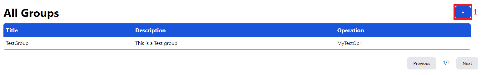

This opens the group creation form.
Here you need to fill in at least the required fields for the group creation form (**1**).
The only required field is the title. 
All other fields ore optional.
For more information on how to add and remove group members see the section on :ref:`members`.
If you have selected on associated operation only members of that operation can be added as group members.
If you want to create a group with the provided data click on the Create Group button (**2**).
If you do not want to create a group and instead return to the group page click the Cancel button (**3**).

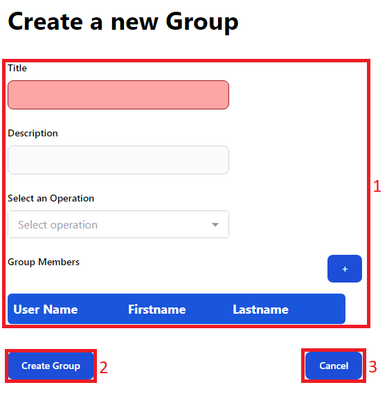

Editing & Deleting Groups
^^^^^^^^^^^^^^^^^^^^^^^^^

To change a group click on the group in the paginated table of groups you want to change (**1**).

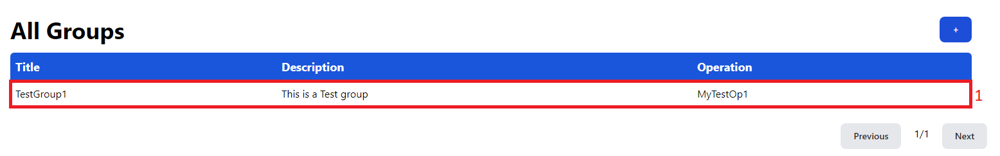

This opens the group update form.
Here you  can change the title, description, associated operation and the group members in the group update form (**1**).
For more information on how to add and remove members see the section on :ref:`members`.
If you have selected on associated operation only members of that operation can be added as group members.
If you want to change the group with you provided data click on the Update Group button (**2**).
Be aware that only users with the *group.update* permission can click this button.
If you want to delete the gorup click the Delete Group button (**3**).
Be aware that only users with the *group.delete* permission can click this button.
If you do not want to change the group and return to the groups page click on the Cancel Button (**4**).

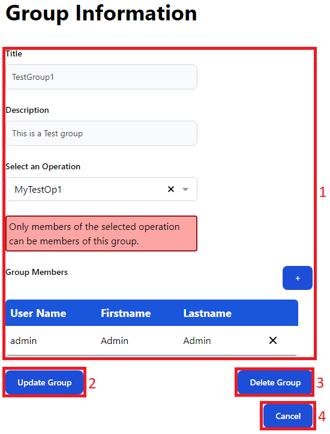

.. _members:

Member Management
-----------------

When managing members users can either be added or removed from the members list.
To remove users from the members list click on the x (**1**) after the entry in the members list you want to remove

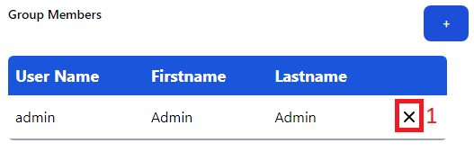

To add users to the member list first click on the + button above the member list (**1**)

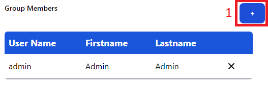

This opens a modal where you can select a number of users to add to the members list.
Here you can either select members to add by click on them in the paginated table (**2**).
This table is navigable with the previous (**3**) and next (**4**) buttons.
You can also select members by clicking on the select box (**1**) and then type the
user you want to add. You get a result of the first 20 possible members found as a dropdown.
Select the user you want to add as a member from the drop down.

.. image:: ../images/member_selection_unselected_marked.png
  :width: 400
  :alt: Member selection modal with nothing selected

After selecting a user to be added to the members list in either way the user will be highlighted in the table (**2**) and appear as a bullet next to the user select (**1**).
You can click on these to deselect them.
If you want to the selected users to the members list click on the Add Members button (**3**).
If you do not want to add them to the members list simply close the modal.

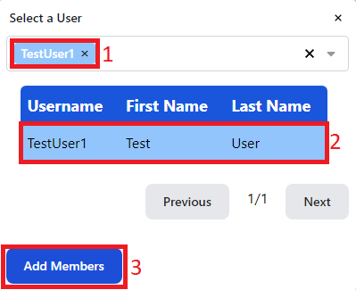

